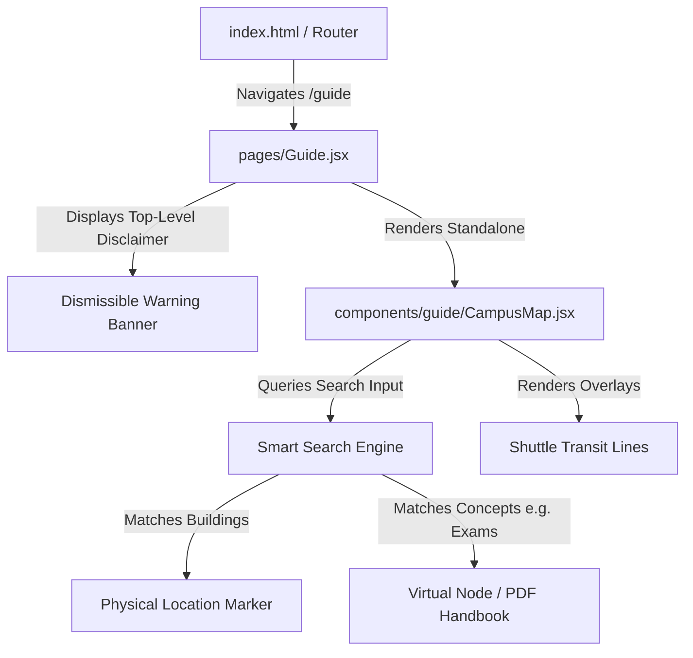

# Campus Guide Transition: Map-Centric Spatial Campus Assistant

This document outlines the roadmap and technical specifications to transition the **Campus Guide** application from a textbook-like list of guide topics to a fully interactive, spatial **Campus Assistant** built around the **Campus Map** interface.

---

## 1. Architectural Overview & Design Shifting
The core idea is to remove the traditional, hard-to-maintain 30+ text guide categories and centralize all campus information, rules, and transit lines into physical and virtual locations on the map.



### Key Enhancements:
1.  **Direct Routing**: Clicking the "Map" button on the Sidebar or Tab Bar directly opens the map view.
2.  **Top-Level Page Disclaimer**: A warning banner is displayed at the top of the map to notify students about coordinates accuracy. It is easily editable and located directly at the top of [src/pages/Guide.jsx](file:///c:/Users/user/Desktop/Campus%20guide/src/pages/Guide.jsx).
3.  **Spatial Wiki Context**: Selecting a building displays its history, trivia, and rules (e.g., library rules when viewing Sam Jonah Library).
4.  **Transit Planning**: Overlay shuttle routes and schedule stops directly onto the map canvas.

---

## 2. Phase-by-Phase Technical Specifications

### Phase 1: Database & Static Data Extensions
We need to expand the mapping data structures in [src/data/campuses.js](file:///c:/Users/user/Desktop/Campus%20guide/src/data/campuses.js) and [src/data/guide.js](file:///c:/Users/user/Desktop/Campus%20guide/src/data/guide.js) to hold rich trivia and virtual regulation attributes.

Create a new file: `src/data/campusMapDetails.js`
```javascript
// Example details structure
export const CAMPUS_BUILDING_DETAILS = {
  "Sam Jonah Library": {
    foundingYear: 2008,
    historicalContext: "Named after Sam Jonah, former Chancellor of UCC. One of the largest library complexes in West Africa.",
    funFacts: [
      "Initially built with a seating capacity of 2,000+ students.",
      "Houses rare historical archives and past exam documents."
    ],
    rules: [
      "Strict silence must be maintained.",
      "Bags and snacks must be checked in at the entrance."
    ]
  }
};

// Virtual Nodes representing administrative concepts
export const CAMPUS_VIRTUAL_NODES = [
  {
    id: "v-registrar",
    title: "Registrar's Office (Academic Policies)",
    description: "Official guidelines on grading systems, GPA calculations, and resit exams.",
    searchKeywords: ["exams", "resit", "grading", "gpa", "handbook"],
    handbooks: [
      { name: "Undergraduate Student Handbook (PDF)", url: "/docs/handbook.pdf" },
      { name: "Academic Regulations & Malpractice Guidelines", url: "/docs/exam_rules.pdf" }
    ]
  }
];

// Transit Route Overlays
export const CAMPUS_SHUTTLE_ROUTES = {
  "Line-A": {
    name: "North Campus Shuttle (Blue Line)",
    color: "#3c728f",
    stops: ["Science Station", "Administration Block", "Sam Jonah Library"],
    coordinates: [
      [-1.290810, 5.115788],
      [-1.291200, 5.116500],
      [-1.292500, 5.117200]
    ]
  }
};
```

---

### Phase 2: Smart Search Integration
We will update the search parser inside [CampusMap.jsx](file:///c:/Users/user/Desktop/Campus%20guide/src/components/guide/CampusMap.jsx) to match keywords against both physical locations and virtual regulation nodes:
*   If a student searches for `"exams"`, `"grading"`, or `"gpa"`, the search returns the `Registrar's Office (Academic Policies)` node at the top of the list.
*   Selecting it triggers a slide-up drawer displaying links to official PDF handbooks and grading rules.

---

### Phase 3: Map Overlay & UI Enhancements
1.  **Visual Shuttle Overlays**: Render colored line paths representing transit routes.
2.  **Slide-Up Drawer Tabs**:
    *   **Overview Tab**: Physical location description and quick walking directions.
    *   **History Tab**: Render `foundingYear`, `historicalContext`, and `funFacts`.
    *   **Regulations Tab**: Dynamically render building-specific rules (e.g., exam malpractice rules if viewing the Great Hall).
    *   **Transit Connections Tab**: Shows which shuttle lines pass nearby.

---

### Phase 4: Location Disclaimer Isolation
To keep the accuracy notice highly maintainable, it is rendered as an absolute overlay at the page level in [src/pages/Guide.jsx](file:///c:/Users/user/Desktop/Campus%20guide/src/pages/Guide.jsx).

```javascript
// Location Accuracy Disclaimer inside Guide.jsx
const [showMapDisclaimer, setShowMapDisclaimer] = useState(true);

// Render inside JSX:
{showMapDisclaimer && (
  <div className="absolute top-16 left-1/2 -translate-x-1/2 z-[1000] ...">
    <AlertTriangle size={18} />
    <p>Some locations might not be 100% correct. We are working hard to build the best location system.</p>
    <button onClick={() => setShowMapDisclaimer(false)}><X size={18} /></button>
  </div>
)}
```

---

## 3. Verification & Launch Plan
*   **Run Build check**: Verify compilation using `npm run build`.
*   **Search Engine Test**: Confirm typing `"exams"` displays the virtual node card containing PDF handbook links.
*   **Contextual Alert Test**: Select an examination center and verify the exam rules warning card renders on screen.
*   **Map Alignment Test**: Confirm all custom vectors (lines, markers) align correctly with underlying maps.
